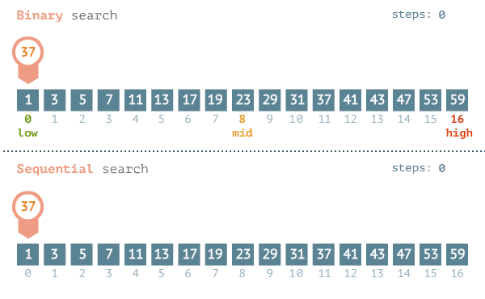
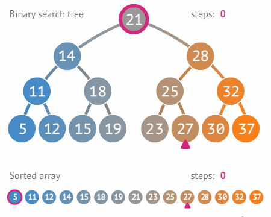

<p align="center">
    <a href="https://kotlinlang.org" target="_blank">
        
    </a>
</p>

# Binary Search in Kotlin (JVM) - Console Application

> "A **pesquisa** ou **busca binária** (em inglês binary search algorithm ou binary chop) é um algoritmo de busca em 
> vetores que segue o paradigma de **divisão e conquista**. Ela parte do pressuposto de que o vetor está ordenado e 
> realiza sucessivas divisões do espaço de busca comparando o elemento buscado (chave) com o elemento no meio do vetor. 
> Se o elemento do meio do vetor for a chave, a busca termina com sucesso. Caso contrário, se o elemento do meio vier 
> antes do elemento buscado, então a busca continua na metade posterior do vetor. E finalmente, se o elemento do meio 
> vier depois da chave, a busca continua na metade anterior do vetor.
>
> -- [Pesquisa Binária - Wikipedia](https://pt.wikipedia.org/wiki/Pesquisa_bin%C3%A1ria)




## Dependencies

- [Java `v11`](https://www.oracle.com/br/java/technologies/javase/jdk11-archive-downloads.html)
- [Kotlin `v1.8.0`](https://kotlinlang.org/docs/whatsnew18.html)

## Complexity Analysis

A complexidade do algoritmo de **Busca binária** é da ordem de **`O(log n)`**, em que **`n`** é o tamanho do 
vetor de busca. Apresenta-se mais eficiente que a **Busca linear** cuja ordem é **`O(n)`**.

## Procedure

Dado uma lista **&Alpha;** de **`n`** elementos com os valores **&Alpha;<sub>0</sub>, &Alpha;<sub>1</sub>, 
&Alpha;<sub>2</sub>, ..., &Alpha;<sub>n-1</sub>** ordenada de tal modo que **&Alpha;<sub>0</sub> &le; 
&Alpha;<sub>1</sub> &le; &Alpha;<sub>2</sub>  &le; ... &le; &Alpha;<sub>n-1</sub>**, e um valor para pesquisa 
**`T`**, a seguinte rotina usa pesquisa binária para achar o índice de **`T`** em **&Alpha;**.

1. Defina **`L`** para `0` e **`R`** para `n - 1`.
2. Se **L &gt; R** a pesquisa termina sem sucesso.
3. Defina **`m`**(o índice do meio da lista) para **`(L + R) / 2`** arredondado.
4. Se **&Alpha;<sub>m</sub> &lt; T**, defina **`L`** para **`m + 1`** e volte ao segundo passo.
5. Se **&Alpha;<sub>m</sub> &gt; T**, defina **`R`** para **`m - 1`** e volte ao segundo passo.
6. Se **&Alpha;<sub>m</sub> = T**, a pesquisa está feita, o índice de **`T`** é **`m`**.

> Para o algoritmo computacional ser mais eficiente, foi implementado uma validação de **Lista vazia**, evitando-se a 
> execução de procedimentos desnecessários! 

## How to run?

```shell
./gradlew run
```

### With empty list

> 

### With a search lower than list

> 
> 
> 

### With a search higher than the list

> 
> 
> 

### With a random search

> 
> 
> 
> 
> 
> 
> 

> É possível observar que nem sempre a função nativa da linguagem 
> [`binarySearch()`](https://kotlinlang.org/api/latest/jvm/stdlib/kotlin.collections/binary-search.html) é a que 
> possui a melhor performance!

## How to test?

Using only native [kotlin.test](https://kotlinlang.org/api/latest/kotlin.test/index.html) and JUnit5.

```shell
./gradlew test
```